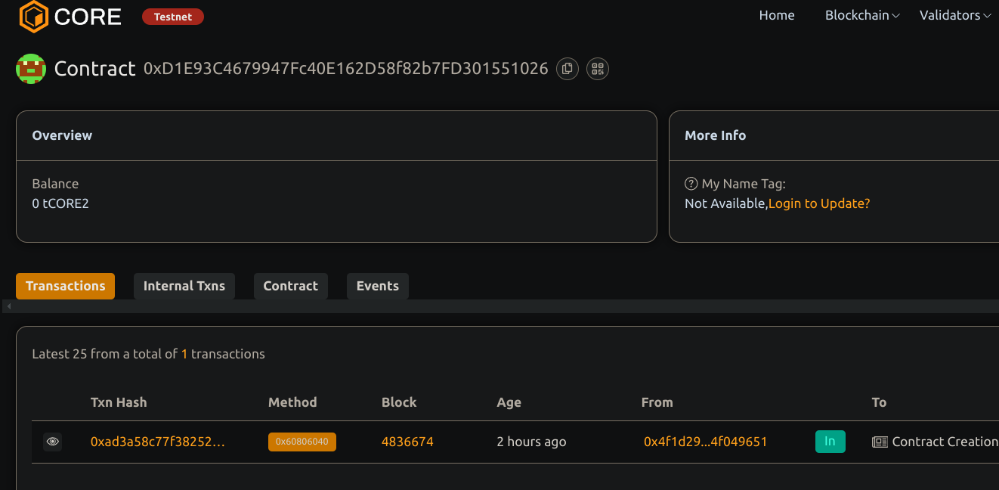

# TimeLockedSavings

## Project Description
- TimeLockedSavings is a smart contract designed to enable users to deposit funds with a specified lock period. During this lock period, withdrawals are restricted, ensuring that funds remain untouched until the set duration has passed.

## Project Vision
- To promote financial discipline through a secure, decentralized savings mechanism. TimeLockedSavings leverages blockchain's transparency and immutability to enforce time-based withdrawal constraints and build user trust.

## Key Features
- Custom Lock Duration: Users can choose a specific time period during which their deposited funds will remain locked.
- Time-Based Withdrawals: Funds can only be withdrawn after the lock period expires.
- On-Chain Transparency: Real-time visibility of user balances and unlock times on the blockchain.
- Event Logging: Emits events for deposits and withdrawals, enabling seamless tracking and integration with external applications.

## Future Scope
- Multiple Concurrent Deposits: Allow users to manage several locked deposits simultaneously.
- Interest Accrual: Introduce interest on locked funds to incentivize long-term saving.
- DeFi Integration: Leverage DeFi protocols to generate yield on user deposits during the lock period.
- User Interface: Develop a frontend dashboard for intuitive account management and improved user experience.

## Contract details
0xD1E93C4679947Fc40E162D58f82b7FD301551026
